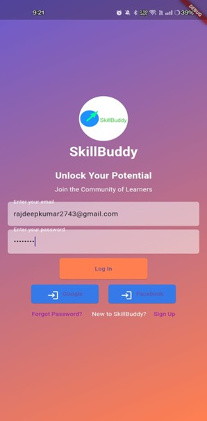
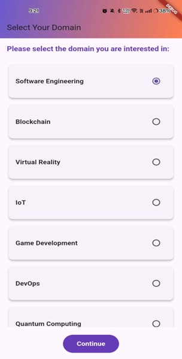
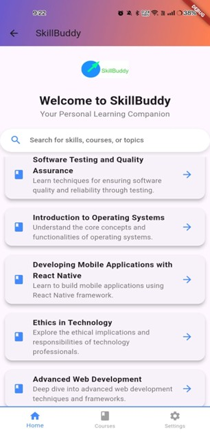
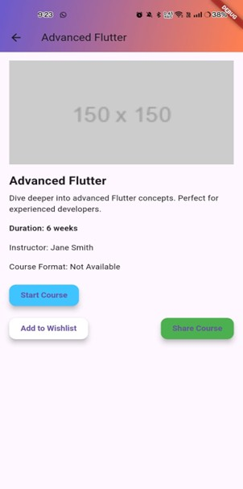
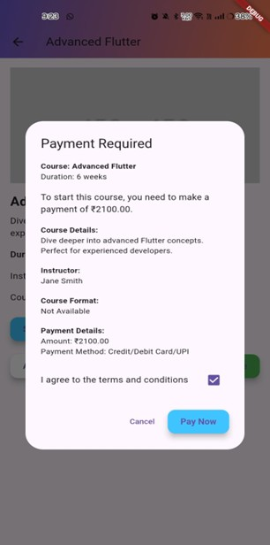

# 🚀 SkillBuddy — Learning Made Smarter

SkillBuddy is a personalized learning platform that helps users acquire skills through **interactive courses**, **tailored learning paths**, and **community support**. It offers a flexible and user-friendly platform designed to boost engagement, career readiness, and continuous skill development across various domains.
This repository contains the **frontend UI** for the SkillBuddy mobile app.

---

## ✨ Features

* 📚 Interactive learning modules
* 🧠 AI-powered learning suggestions
* 🎯 Personalized skill pathways
* 🏆 Gamified progress & achievements
* 👥 Community support & peer learning
* 🌙 Clean, modern UI with smooth animations

---

## 🛠️ Tech Stack (Frontend)

| Technology                    | Purpose                     |
| ----------------------------- | --------------------------- |
| Flutter                       | UI & Mobile App Development |
| Dart                          | Programming Language        |
| Provider / Riverpod (if used) | State Management            |
| REST APIs                     | Backend Communication       |
| Lottie Animations             | Smooth UI/UX Animations     |

---

## 📦 Folder Structure

```
lib/
 ├── screens/
 ├── components/
 ├── providers/
 ├── models/
 ├── services/
 ├── utils/
 └── main.dart
assets/
```

---

## 🎯 Purpose

Empower learners to **grow faster** with a smart, flexible, and engaging learning experience designed for **career readiness and continuous improvement**.

---

## 📸 Screenshots

                               

                             

---

## 🚀 Getting Started

### ✅ Requirements

* Flutter SDK installed
* Android Studio / VS Code
* Emulator or physical device

### ▶️ Run the App

```bash
flutter pub get
flutter run
```

---

## 🤝 Contributing

Contributions are welcome!
Feel free to open issues or submit pull requests.

---

## 🧩 Future Enhancements

* AI-chat based learning assistant
* Offline learning mode
* Certificates & rewards
* Community discussion boards

---

## 📄 License

MIT License — free to use & modify.

---

## 👤 Author

**Rajdeep Kumar**
📍 Bangalore, India
